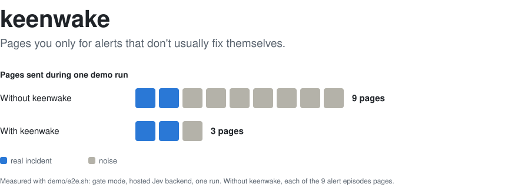
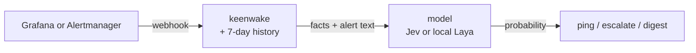

<picture>
  <source media="(prefers-color-scheme: dark)" srcset="docs/img/hero-dark.svg">
  
</picture>

keenwake sits next to Grafana or Alertmanager. For each alert it looks at the last 7 days of that
same alert, asks a small model whether a human should be woken up now, and answers `ping`,
`escalate` or "put it in tomorrow's digest". It starts in observe mode: it records what it would
have done and changes nothing, so you can measure it on your own alerts before trusting it.

## What it sees, what it decides

An alert arrives: `CPU above 90% on etl-2`, severity `critical`, firing for 3 minutes. keenwake
turns its history into plain facts and puts them in front of the alert text:

> Environment: prod. The alert is still firing, for 3 minutes so far. It fired 22 times in the
> last 7 days, and each time it ended, usually within about 3 minutes. This time it looks like its
> usual pattern so far. Alert: CPU above 90% on etl-2. CPU at 92% for 2m. Severity label: critical.

The model returns the probability that someone should be paged now. Low: the alert goes into the
daily digest. If the same alert is still firing 40 minutes later, the facts change ("This time it
has lasted much longer than usual") and so does the answer.



## How it compares

| Tool | What it is | Skips pages for alerts that usually fix themselves? |
|---|---|---|
| Alertmanager `for:` and inhibition | Fixed rules you write by hand | Only what your rules cover |
| PagerDuty Auto-Pause | The same idea as keenwake, inside PagerDuty | Yes, in a paid add-on |
| Keep, Robusta | Group, dedupe and enrich alerts | No |
| HolmesGPT | Finds the root cause after the page | No, it runs after |
| **keenwake** | Reads each alert's history and text, then decides | Yes, open source, can run fully local |

## Numbers

A synthetic corpus of 210 firing alerts (15 scenarios, written by an LLM, labelled "should page"
or not). AUC is the chance that a random alert that should page scores above one that should not.

| Scorer | AUC | Reproduce |
|---|---|---|
| A 3-line rule, no model: "over 3x its median, or no history" + "is prod" | 0.931 | `scripts/cargo.sh test --test corpus` |
| Laya, local (`typed-decisions` @ `55cf4c4e`, RTX 3080) | 0.949 | `--ignored`, see [tests/corpus.rs](tests/corpus.rs) |
| Jev, hosted (`jev-1.13.0`, 210 calls in 49 s) | 1.000 | same |

What this says, and what it does not:

- **History does most of the work.** The rule gets 14 of 15 scenarios right. It cannot tell "TLS
  certificate expires in 17 hours, renewal failed" from "expires in 22 days, renewal scheduled":
  their history is identical, only the text differs. Jev reads the text; the rule cannot.
- **Laya is barely above the rule.** Its value today is that no data leaves the machine, not
  accuracy. The demo below shows the same thing on live alerts.
- **This is a ceiling, not a production result.** Each scenario has one label, which makes the task
  easier than real alerts. The rule was written after looking at the corpus, which flatters it.
  The number that counts is `keenwake report` on your own alerts after a week in observe.

### Demo, measured end to end

`demo/e2e.sh` in gate mode, one run per backend. A chaos script injects noise (six short CPU
flaps, a full disk on staging) then two real incidents (a 5xx spike, a CPU that stays pegged).

| Backend | Real incidents paged | Noise paged | Noise held for the digest | Backend cost |
|---|---|---|---|---|
| Jev | 2 of 2 | 1 | 6 | $0.0004 for 21 calls |
| Laya, on CPU | 2 of 2 | 7 | 0 | none, local |

With Jev, the one noisy page is the very first CPU flap: no history yet, so it pages, as it
should. The pegged CPU first looked like its usual flap and went to the digest, then paged once it
outlasted its usual duration. With Laya at the default thresholds, every flap paged: its scores
barely move with history (0.59 to 0.66 here), which matches its corpus result.

## Quick start

The demo needs only Docker:

```sh
cd demo && ./e2e.sh
```

It starts Prometheus, Alertmanager, three services that fail on purpose, a chaos script that
injects real incidents and background noise, keenwake in gate mode with the local Laya model, and a
sink that logs every page. It exits `0` only if every injected real incident reached the sink as a
page. The first run downloads the Laya checkpoint (about 800 MB).

To run it on your own alerts, write a `keenwake.toml` (see [docs/reference.md](docs/reference.md)),
then:

```sh
docker build -t keenwake .
docker run -e TYPESAFE_API_KEY -v "$PWD/keenwake.toml:/etc/keenwake/keenwake.toml:ro" \
  -v keenwake-data:/data -p 8080:8080 keenwake
```

Add `http://<host>:8080/hook/alertmanager` (or `/hook/grafana`) as an extra receiver, next to the
one you already have. After a week or two, `keenwake report --since 7d` shows what it would have
paged and what it would have held back. Switch to `gate` only if you like what you see.

## Safety

- **Observe is the default.** Your alerts keep going where they go today.
- **In gate, when in doubt it pages.** Backend down, unreadable alert, internal error: the alert is
  sent as `untriaged` rather than dropped.
- **What leaves the machine** with Jev: the sentence above, with emails, IPs and common secrets
  redacted (best effort). With Laya, nothing.
- **`/hook` has no authentication.** Keep keenwake on an internal network.
- **`replay`** re-decides past alerts with a new config or model, so you see what would change
  before you change it.

## When not to use it

- Your alerts already page only on real problems. keenwake has nothing to remove.
- You want it to act on alerts. It only decides who gets told, and when.
- You cannot afford a missed page and cannot run it in observe first.
- Your alerting tool does not send `resolved` notifications: without them there is no history.

## More

- [docs/reference.md](docs/reference.md): the full pipeline, configuration, repeat rules,
  redaction, failure behaviour, known limitations.
- [docs/add-a-source.md](docs/add-a-source.md): plug in a tool other than Grafana or Alertmanager.
- [docs/invariants.md](docs/invariants.md): the rules the code must never break, each with its
  test.

## License

MIT or Apache-2.0, at your option.
