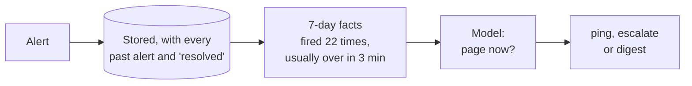

<picture>
  <source media="(prefers-color-scheme: dark)" srcset="docs/img/hero-dark.svg">
  
</picture>

## Why this exists

keenwake is a proof of concept. At a previous job I was pinged for every alert, and most of them
had cleared on their own before I could even look.

Deciding whether to wake someone up is usually a quick judgment, not a long reasoning task. That
is what small "System One" models like Jev are built for: a fast judgment on one narrow question,
here "should a human be paged now?", answered with a probability in about 0.2 s and for a fraction
of a cent per alert. A general-purpose LLM can
answer it too, but it is typically slower and costs more per call, which matters when it sits in
front of every page.

## What it does

keenwake sits next to Grafana or Alertmanager. It remembers every alert, and before paging you it
checks what that same alert did over the last 7 days. An alert that flaps and clears within minutes,
as it always does, goes into a daily digest instead of waking you up.

**Status: v0.1.** Tested on a synthetic corpus and a Docker demo, not yet on a
real on-call rotation. Start in observe mode: it records what it would do and changes nothing.

## How it works



`ping` wakes someone now, `escalate` goes to a less urgent channel, `digest` waits for the daily
summary. In observe mode keenwake only records them; in gate mode it sends them.

The model is either Jev, a small hosted model from TypeSafe (`api.typesafe.ai`, proprietary), or
Laya, an Apache-2.0 model you run locally. Both only ever see the sentence built from the facts and
the alert text. keenwake has no affiliation with TypeSafe or with Laya's authors.

keenwake does not learn: it remembers. The longer it runs, the more history each alert has, and
the better the facts it hands to the model.

## How it compares

| Tool | What it is | Skips pages for alerts that usually clear up quickly? |
|---|---|---|
| Alertmanager `for:` and inhibition | Fixed rules you write by hand | Only what your rules cover |
| PagerDuty Auto-Pause | The same idea as keenwake, inside PagerDuty | Yes, in a paid add-on |
| Keep, Robusta | Group, dedupe and enrich alerts | No |
| HolmesGPT | Finds the root cause after the page | No, it runs after |
| **keenwake** | Reads each alert's history and text, then decides | Yes, open source; a local model works but is weaker today |

## Numbers

210 synthetic alerts (15 scenarios, written by an LLM), labelled "should page" or not. AUC 1.0 means every alert that should page
scored above every one that should not.

| Scorer | AUC |
|---|---|
| A 3-line rule, no model | 0.931 |
| Laya, local model | 0.949 |
| Jev, hosted model | 1.000 |

History does most of the work; the model adds what only the text says ("certificate expires in 17
hours, renewal failed"). Laya's value today is privacy, not accuracy. This corpus is a ceiling, not
a production result. How it was measured, and the demo results: [docs/numbers.md](docs/numbers.md).

## Try it

The full demo (Prometheus, Alertmanager, services that fail on purpose, keenwake) needs only
Docker: `cd demo && ./e2e.sh`. It uses the local Laya model, which pages every flap (see Numbers).
`KEENWAKE_DEMO_BACKEND=jev ./e2e.sh` uses Jev and reproduces the chart at the top.

On your own alerts:

**1. Config.** A `keenwake.toml` with a backend is enough for observe mode:

```toml
[backend]
url = "https://api.typesafe.ai"
model = "jev-1.13.0"
api_key_env = "TYPESAFE_API_KEY"
```

For a fully local setup, run the Laya sidecar from [`sidecar/`](sidecar) and point `url` at it.

**2. Run.**

```sh
docker build -t keenwake .
docker run -d --name keenwake -e TYPESAFE_API_KEY \
  -v "$PWD/keenwake.toml:/etc/keenwake/keenwake.toml:ro" -v keenwake-data:/data \
  -p 8080:8080 keenwake
```

**3. Send it a copy of your alerts,** next to your current receiver. Alertmanager:

```yaml
receivers:
  - name: team            # your existing receiver, unchanged
    slack_configs: [...]
    webhook_configs:
      - url: http://keenwake:8080/hook/alertmanager
        send_resolved: true
```

Grafana: add a Webhook integration to your contact point, URL `http://keenwake:8080/hook/grafana`.
Other tools: [docs/add-a-source.md](docs/add-a-source.md).

The URL must be reachable from your alerting tool (same Docker network, or the host's address).
keenwake takes the environment from an `env` or `environment` label: without one, alerts are
marked `unknown`, and the model knows less about them.

**4. After a week, see what it would have done.**

```sh
docker exec keenwake keenwake --config /etc/keenwake/keenwake.toml report --since 7d
```

If you like what you see, move one low-stakes route to gate mode first. See
[docs/reference.md](docs/reference.md#modes).

## Before you trust it

- In gate mode, when in doubt it pages: backend down or unreadable alert means a page, not silence.
- With Jev, the alert text leaves your machine, with emails, IPs and common secrets redacted. With
  Laya, nothing leaves.
- `/hook` has no authentication. Keep keenwake on an internal network.
- It needs `resolved` notifications. Without them there is no history.
- History starts empty: decisions get useful after a few days of live traffic.
- Everything else, including known limitations: [docs/reference.md](docs/reference.md).

## Where this could go

Ideas, built if people ask for them in an issue:

- A larger LLM rereads past decisions and turns what it finds into rules for the fast model, with a human
  settling only the disagreements.
- An LLM gathers logs and metrics before an escalated page goes out.
- Import past alert history from the on-call tool, so keenwake does not start blind.
- Follow the trend inside an alert. Today a CPU climbing from 91% to 99% while it fires stays in the
  digest (measured): only how long it lasts counts, not whether it gets worse.

## License

MIT or Apache-2.0, at your option.
